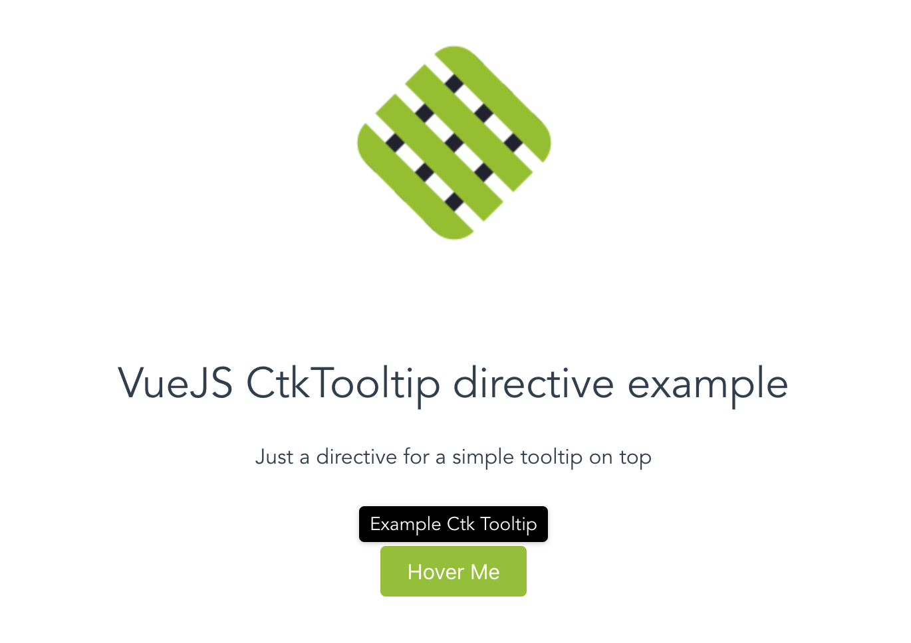

# vue-ctk-tooltip



Just a directive for a simple tooltip

## Installation

### npm
``` sh
npm install --save vue-ctk-tooltip
```

## Usage

#### Globally
  main.js
```js
import Vue from 'vue'
import CtkTooltip from 'vue-ctk-tooltip'

Vue.directive('ctk-tooltip', CtkTooltip)
```

#### In single component
YourComponent.vue 
```vue
import CtkTooltip from 'vue-ctk-tooltip'
export default {
  name: 'YourComponent',
  directives: {
    CtkTooltip
  }
}
```

```html
<button v-ctk-tooltip="'Your tooltip message'">Hover Me</button>
```

## Example
An [example](https://github.com/chronotruck/vue-ctk-tooltip/tree/master/example) is available | (Documentation [here](https://github.com/mimani/vue-just-another-dropdown/blob/master/example/just-another-vue-app/README.md))

